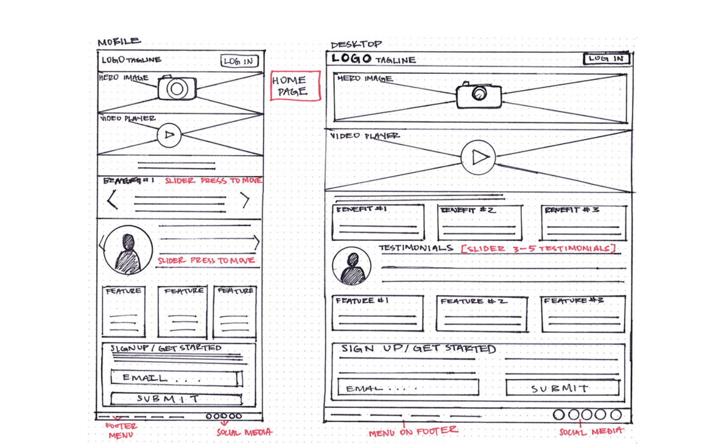

# App Planning Lab

## Getting Started

1. Fork and clone this repository.

1. Answer the questions below by editing this readme. Leave the questions and prompts, and answer in between them. Make sure when you read back your work that you've written things clearly, so that anyone reading it can easily understand what you've written.

1. Where applicable add screenshots, photos, and links.

1. You will also deploy an `index.html` page to GitHub pages.

## Instructions

You will be planning a new application to develop that will be a competitor for another popular application. Your goal is to determine the minimal functionality required so you can launch your app as soon as possible.

Choose from any popular app. It can be an app for anything:

- Music
- TV/Videos
- Shopping
- Social media
- Blog
- Forum (like Stack Overflow or Reddit)
- Chat app
- Recipes
- Business reviews

## Questions

## Project Managing Tool

#### In 1-3 sentences describe your application.

> Our app is an auto parts app. You can buy car parts by vehocle make, item brand, etc.

#### What is the name of your application?

> PARTS-R-US

#### Create a minimum of 10 user stories. Make sure to use the format:

- `As a <type of user>, I want to <some goal>, so that <some reason>.`

Write the user stories below. Add more `>` for each user story or use `-` to make a list

> - As a car owner, I want to easily search for and find car parts, so that I can quickly locate the parts I need for my vehicle.

> - As a mechanic, I want to find detailed part descriptions, so that I can make the best choices for customer vehicles.

> - As a customer, I want to explore a categorized catalog of parts, so that I can discover and enhance my project car.

> - As a customer, I need filters for price, brand, and compatibility, so that I can easily find the right parts within my budget.

> - As a mechanic, I want order history for inventory management, so that I can efficiently track and reorder parts.

> - As a shop owner, I want sale and restock notifications, so that I can take advantage of discounts and maintain my inventory.

> - As a seller, I want to list and manage my parts inventory, so that I can handle sales more efficiently.

> - As a distributor, I need sales performance reports, so that I can make inventory and product decisions.

> - As a user, I want to read and submit part reviews, so that I can make choices off the recommendations of others.

> - As an admin, I want to manage accounts and ensure platform security, so that the application remains safe and reliable.

#### Create a new board

Follow the format provided (name of board, the 5 lists etc.) in the reading.

- Add a minimum of 5 cards (front only) based on your user stories to `Backlog`.
- Add appropriate labels.

Provide a link to your board below.

> PARTS-R-US: https://trello.com/b/ad83hE2l/kanban-template

#### For one card, fill out more details, include:

- The business case
- Acceptance criteria
- Notes
- Resources

Move that card to the `Doing` list and assign yourself to it.

Provide a link to the specific card below.

> [Detailed card] - https://trello.com/c/np9C5mDC

#### Create one bug card.

Think back to a bug you had in a recent lab or project and do your best to model that example.
It can either be a bug you solved or that you didn't get a chance to solve.

It should include:

- A brief description of the bug.
- The expected behavior.
- The steps to reproduce.
- At least one resource.

Make sure to label it as a bug. Move the card to the `To Do` list.

Provide a link to the specific card below.

> [Bug card] - https://trello.com/c/oyXmdcu1

#### Create one chore card

Think back to a chore you had in a recent lab or project and model that example. Move the chore to the `Done` column.

- Assign yourself to it.
- Add a due date.

Provide a link to the specific card below. (remember to add the link, without quotes, in the README.md inside the parenthesis)

> [Chore card] - https://trello.com/c/xpoUnrQ4

### Wireframes

Create three wireframes. You may use a free online tool or draw them on paper (you can either scan them or use your phone to photograph them). You will upload them to this repository and save the images in the assets folder. For each link below add the url to the parenthesis. No quotes needed in the url address.

**Create a mobile wireframe for the landing page view.**

[My Mobile Landing Page Wireframe Link](./assets/mobile.png)

**Create a landing page wireframe for a wide desktop view.**

[My Desktop Main Page Wireframe Link](./assets/desktop.png)

**Create a wireframe for a form (new user, new shipping information, new post, new song, new product etc.) view. (mobile or desktop)**

[My Form Wireframe Link](./assets/form.png)

## Reflection

Write down three things that went well for you doing this lab.

- Evenly distributed work
- Learned more about how to use Trello
- Created our first wireframes on a whiteboard

Write down one thing you'd improve on for next time.

> One thing I'd improve is learning how to use Figma

Please list out your Team Members if you worked on a team:

1. Jose Barrios
2. Chris Miranda

## Bonus:

### Minimum Viable Product

Create an `index.html` file and a `styles.css` file. Using your user stories and wireframes build the responsive `index` view. You should use `lorem ipsum` placeholder text and placeholder images, where applicable. The index view should have between 2 and 5 example resources.

Deploy this to GitHub pages.
